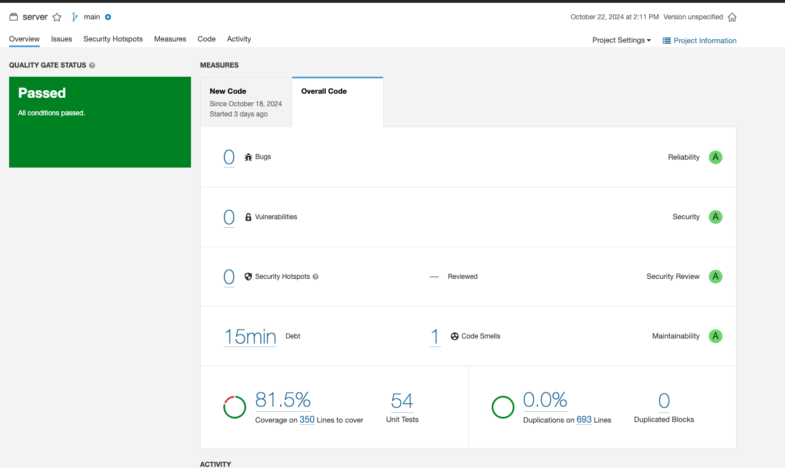
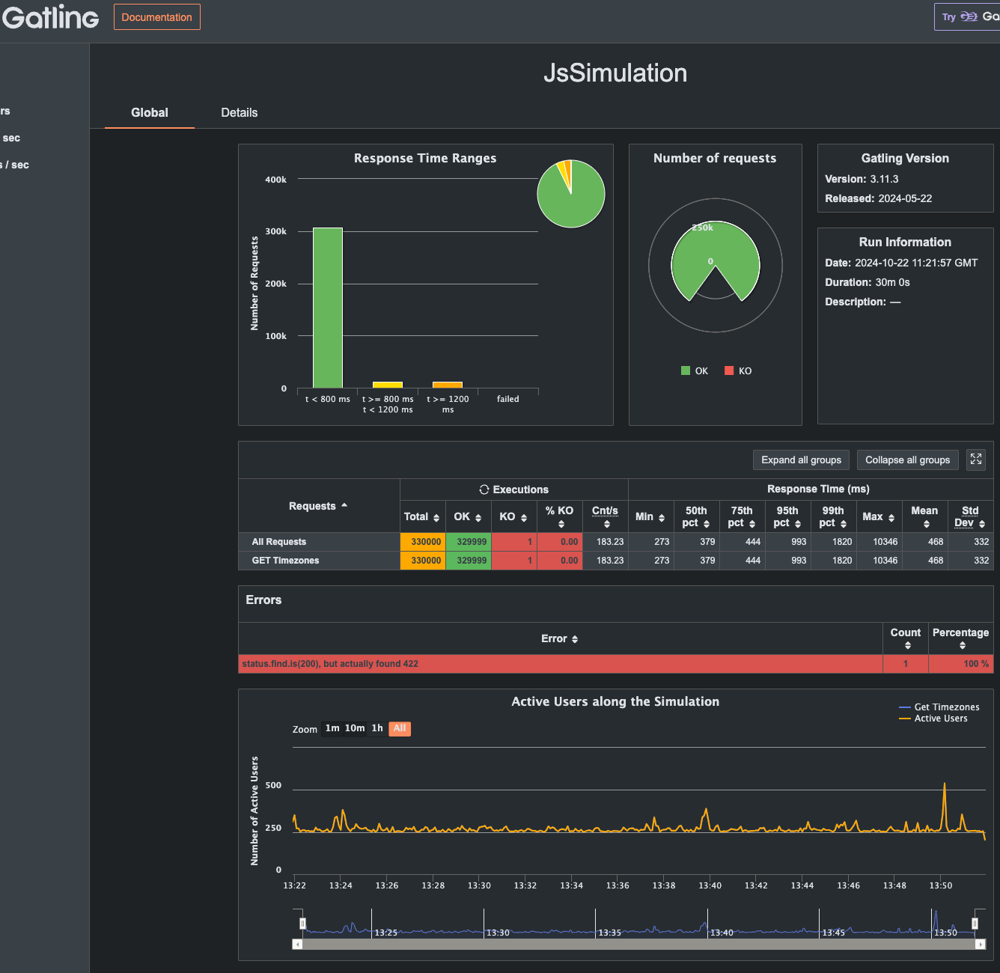
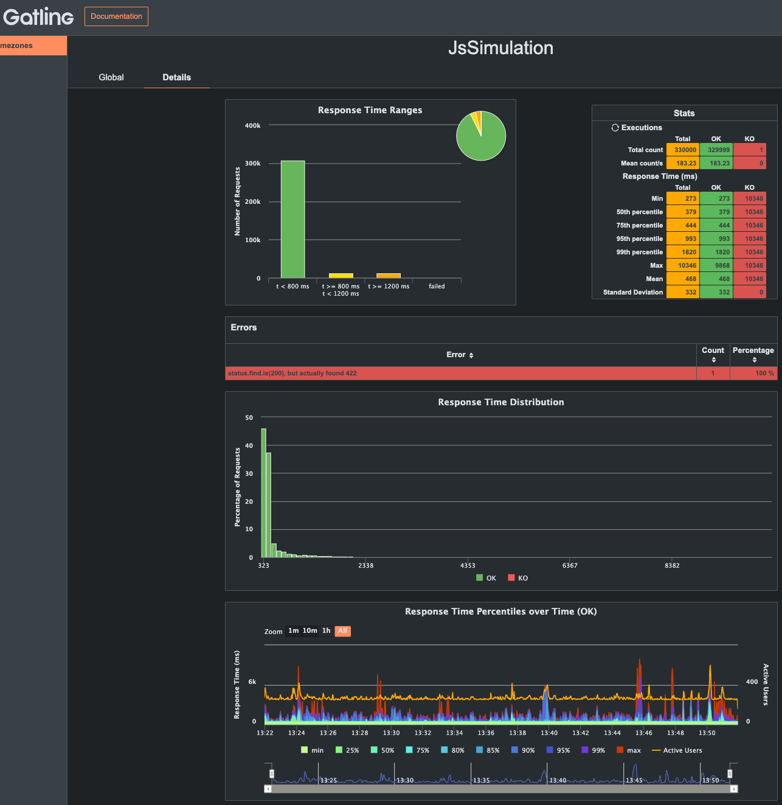
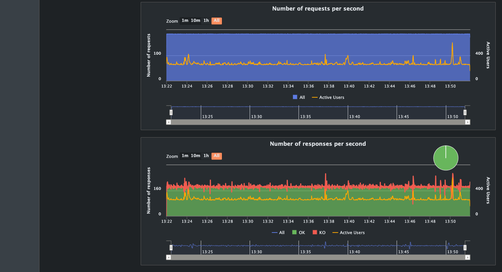
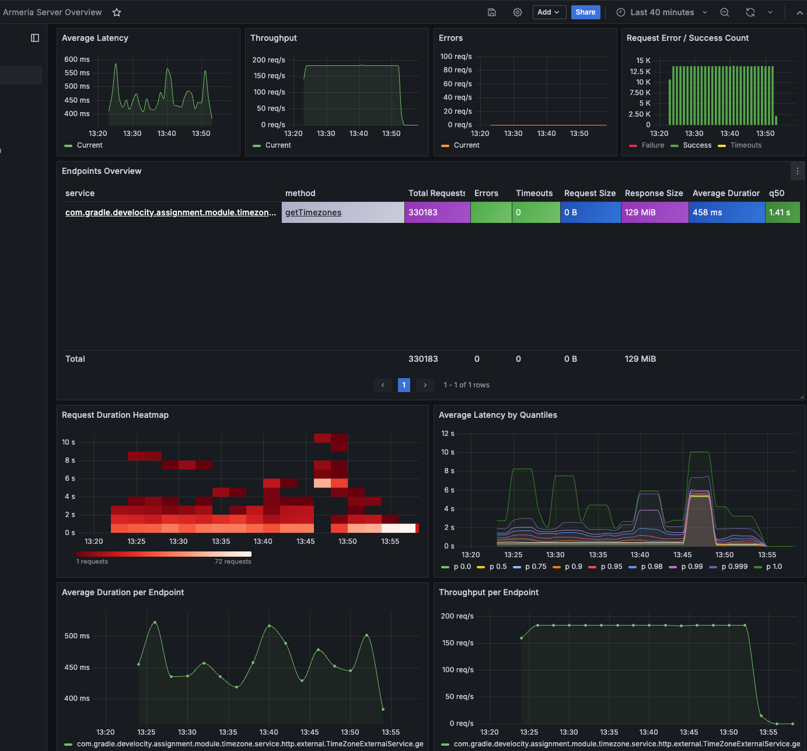

# Develocity Backend Code Project

Congratulations on advancing to the code project for a Backend Engineer position on the Develocity team!

This project aims to allow you to demonstrate your expertise and skills using an industry-standard language such as `Java` or `Kotlin`, a modern microservice library that embraces asynchronous programming as provided by `Armeria`, one or more testing frameworks of your choice, and the widely-adopted build tool `Gradle`.

## Installation instructions

You are already provided with a scaffold, including a Gradle build to assemble and run a HTTP server.

From the root of this project, start the minimal server and navigate to [http://localhost:5555/](http://localhost:5555/):

`./gradlew :server:start`

## Implementation instructions

Follow the detailed instructions in the PDF that have been provided to you via email.

## Validation instructions

Ensure the server is assembled and the automated test suites executed when running the following command:

`./gradlew :server:build`

## API Documentation

### Security and Authentication
* Authentication: All API endpoints, except for the API documentation, are secured using API key authentication. The API key must be provided in the request headers as an Authorization header in the following format:

    ```http request
    Authorization: apikey %YOUR_API_KEY%
    ```
    This ensures that only authorized users with a valid API key can access the service's functionality.

* Rate Limiting: Every API endpoint is also protected by a rate limiter to prevent potential brute force or DDoS attacks. The rate limiter helps ensure that all APIs function reliably, even under heavy traffic or attempted misuse.

These security measures ensure system stability, protect against unauthorized access, and help maintain service availability.

### API documentation resources
The API documentation is available at the /documentation endpoint. This resource provides detailed information on each API endpoint and includes the ability to try out requests directly from the documentation interface.
Once server is started locally can be accessed using following urls:
* HTTP: http://127.0.0.1:5555/documentation
* HTTPS: http://127.0.0.1:5443/documentation

### Possible response statuses

* `200 OK`: The request was successfully processed and completed.
* `400 Bad Request`: The request failed validation (e.g., invalid input).
* `401 Unauthorized`: The request was not authenticated due to missing or invalid credentials.
* `404 Not Found`: The requested resource could not be found.
* `429 Too Many Requests`: The rate limit has been exceeded.
* `422 Unprocessable Content`: The request was well-formed but could not be processed. Please contact support if this continues.
* `500 Internal Server Error`: An unhandled error occurred, and the server could not recover from it.

### Custom response headers
For rate-limited endpoints, the following headers are returned:

* `ratelimit-remaining`: Indicates the number of remaining attempts before the rate limit is reached.
* `ratelimit-reset`: Specifies the time (in seconds) until the rate limit is reset, allowing new requests.

### GET /timezones
This endpoint allows users to retrieve time zone details for a provided list of cities, passed as comma-separated values. City names can either be an exact match or utilize a special wildcard search syntax, such as `city=* city*`. The wildcard search term must contain at least 5 characters.

All request and response details can be found at the `/documentation` resource, which includes the ability to test the API directly.

Example of a Successful Response (Exact Match for `Yosemite Valley`):

```json
{
  "success": true,
  "cities": [
    {
      "city": "Yosemite Valley",
      "state": "California",
      "time": "2024-10-21 12:31:41",
      "zone": "PDT",
      "utcOffset": -7
    }
  ]
}
```

Validation:
400 Bad Request – The request failed validation for one of the following reasons:
* A city value is blank.
* The wildcard search term contains fewer than 5 characters.
* More than 10 cities are provided in the request.

Example of validation error: 

Request: `/timezones?city=Oakland,  ,Denver,  ,New York`

```json
{
    "success": false,
    "errorMsg": "Validation Exception",
    "errors": [
        {
            "field": "city[1]",
            "message": "Must not be empty"
        },
        {
            "field": "city[3]",
            "message": "Must not be empty"
        }
    ]
}
```

## Reasoning

### Other choices and considered alternatives

#### 1. API documentation
I’ve included Armeria’s DocService in my project to automatically generate and maintain up-to-date API documentation. This is a key component for exposing the API to external consumers because it ensures that the documentation is always current and reflects any changes in the API without manual intervention.

Having an always-updated API documentation is crucial, as it enhances collaboration between teams and external users by providing accurate information on endpoints, request/response structures, and other critical API details. The DocService feature saves time and effort in maintaining documentation, making sure developers can easily access the latest version of the API spec without needing to dig into the codebase.

#### 2. Rate limiter
I’ve integrated Armeria's Bucket4j asynchronous rate limiter in my project because it provides an easy way to implement rate limiting. This feature is crucial for controlling the flow of incoming requests to ensure that the system doesn't get overwhelmed by too much traffic. Using this asynchronous rate limiter allows me to manage request limits efficiently without blocking threads, which helps maintain the performance and responsiveness of the application, even under heavy load.

The asynchronous nature of the rate limiter is particularly beneficial in my case, as it allows for smooth handling of high-concurrency scenarios without sacrificing performance, while still protecting the backend services from overuse.
Rate limiter is added to all exposed endpoints: 
- API documentation 
- prometheus metrics endpoint
- timezone API endpoint

Rate limiter is implemented using Armeria service decorator and armeria-bucket4j library. 

#### 3. ApiKey authentication

I've implemented basic API key authentication in our project to ensure that only authorized users can access the API. This approach provides a straightforward method of securing our endpoints by requiring clients to supply a valid API key with each request. It helps protect our services from unauthorized access, while also being simple to implement and manage.
Using API key authentication is an efficient way to control access, especially for internal or partner-facing APIs, where simplicity and ease of integration are key requirements. It strikes a good balance between security and usability for our current needs.
Authentication is implemented using Armeria service decorator.<br /><br />
I opted to implement API key authorization through headers instead of using query parameters to ensure sensitive information, like the apikey, is not logged in server access logs. This approach enhances the security of the system by preventing API keys from being exposed in URLs, which could be inadvertently logged or cached by intermediary systems like proxies or browsers.
By placing the API key in the header, we minimize the risk of it being exposed, providing a more secure way to authenticate API requests.

#### 4. Response encode/compression
In our project, I’ve leveraged Armeria’s built-in decorators to encode and compress API calls, which has significantly improved performance, especially when interacting with external services.

For instance, when we query the TimezoneDB external API using a parameter like city=* city*, the result includes 512 unique cities. Without applying encoding or compression, the response size would be around 50KB. However, by using Armeria's encoding and compression decorators, we’ve reduced the payload size down to just 4.7KB, a substantial optimization.

This not only speeds up data transfer between the client and server but also reduces bandwidth consumption, resulting in faster response times for end-users and improved overall API performance.

#### 5. TimezonesDB get-timezones External API
During my investigation of the TimezoneDB API, I discovered several key optimizations and limitations that helped enhance the efficiency and robustness of our API calls:

Optimizing Response Size: I found that we can specify which fields we want in the response. By including only the necessary fields, we were able to reduce the size of the returned response by more than half. This optimization minimizes unnecessary data transfer and improves performance.

Wildcard Search Validation: I also observed that the get-timezones API throws an error if a wildcard search term for a city is less than 5 characters (without the wildcard * character). To handle this, I implemented a validation to ensure the search term meets the required length, preventing unnecessary API errors and improving the reliability of our calls.

`limit` query parameter and pagination issue: Another interesting observation was that the API allows you to set the limit query parameter to any value, enabling us to retrieve all 512 records for the search term `city=* city*` in a single call. However, this leads to an inconsistency: the `totalPage` response field is always calculated as if `limit=10` is being used, regardless of the actual `limit`. While this was an intriguing discovery, I opted not to rely on this behavior since it’s not documented officially, and there’s a risk that TimezoneDB may change or disallow it in the future.

By applying these optimizations and safeguards, we’ve reduced data payloads, improved validation, and ensured that our integration with the TimezoneDB API is both efficient and stable.

#### 6. Parallelizing External API Calls with Kotlin Coroutines
To enhance the performance of our service, I’ve leveraged Kotlin coroutines to parallelize calls to the external TimezoneDB API. By utilizing coroutines, we can concurrently fetch data for each city and handle pagination in parallel, significantly speeding up the overall response time.

This approach allows the service to process multiple requests simultaneously, reducing latency and improving user experience, especially when handling large datasets or multiple cities in a single request.


#### 7. Code organization

To ensure a clean, modular structure and maintain code scalability, I’ve organized the Armeria services into distinct modules, each with its own set of dedicated packages. This approach helps keep the codebase well-structured, promotes separation of concerns, and makes it easier to manage and maintain.

For example, the `module.timezones` is structured as follows:

* `module.timezone.service.http.external`: This package contains the services responsible for interacting with external sources of data, specifically the external REST APIs we rely on, such as TimezoneDB. The naming convention reflects that these services are fetching data externally.

* `module.timezone.contract.http.external.response`: Here, we define the response models received from external APIs. This separation ensures that external API models are isolated and do not mix with our internal representations, making future updates to external dependencies easier to manage.

* `module.timezone.dto`: This package defines the request and response payloads for our exposed /timezone API. By separating the data transfer objects (DTOs) from external API responses, we can maintain control over what is exposed to clients and ensure consistency in our public API.

* `module.timezone.validator`: This is where is implemented validation logic for the `/timezone` API. Having a dedicated package for validators allows us to centralize validation rules and ensures that input is properly sanitized before further processing.

* `module.timezone.mapper`: Here are the implemented mappers that transform data between the external API and our internal DTOs.

Additionally, there is a `common` package where shared functionality is centralized, including:

* Server configuration: Contains the settings and configurations necessary for Armeria’s server setup.
* Decorators: Custom decorators used across the services, such as encoding, compression, or authentication handling.
* Exception handlers: Centralized logic for handling exceptions globally across all modules, ensuring consistent error responses.
* Custom exceptions: Defines common exception classes that are shared across the services to maintain unified error handling.
* Common validation logic: Shared validation utilities that can be reused across different modules.
* Utils: Utility classes for common functionalities that do not belong to a specific module.
* WebClient factory: A shared factory for creating web clients that interact with external APIs, ensuring consistency in how external calls are handled.

* This modular architecture provides a clear separation of responsibilities, ensures that components are reusable, and enhances maintainability as the project grows.

#### 8. `/metrics` Endpoint
`Prometheus /metrics` endpoint is exposed and accessible as prometheus target for scraping.

#### 9. Prometheus and Grafana

The exposed metrics will be scraped by Prometheus, which will serve as a data source for Grafana. This setup provides real-time monitoring and visualization of application performance.
For local development, you can start Prometheus using Docker. Navigate to the external-docker-compose/grafana-prometheus folder and run the following command to start the necessary services:

```bash
docker-compose -f grafana-prometheus-docker-compose.yml up -d
```

This will launch both Prometheus and Grafana. The services will be available at:

* Prometheus: http://localhost:9090
*  Grafana: http://localhost:3000
* - Username: admin
* - Password: grafana

After logging into Grafana, you can import the `Armeria dashboard` for a comprehensive view of the server metrics. 
Use the following link to import the Armeria Server Overview dashboard:
- https://grafana.com/grafana/dashboards/19218-armeria-server-overview/

#### 10. Sonarqube
I am using SonarQube in my project to continuously analyze code quality and detect potential bugs, security vulnerabilities, and code smells. SonarQube helps ensure that the codebase adheres to industry best practices, maintains high standards of maintainability, and minimizes technical debt over time.
To start `sonarqube` locally use this docker command:

```bash
docker-compose -f external-docker-compose/sonarqube-docker-compose.yml  up -d
```




### Security and possible vector attacks
#### Man In The Middle attacks
I configured the server to use a self-signed certificate to enable TLS support, ensuring encrypted communication and preventing potential man-in-the-middle attacks. This step adds a layer of security by encrypting the data exchanged between clients and the server.

However, in production environments, TLS should typically be terminated at the entry point of the infrastructure—such as a load balancer or API gateway—instead of directly on the service itself. This is because the service will be deployed inside a private VPC, where it’s protected by internal network security measures. Of course, TLS can also be used for internal communication within the private VPC if additional encryption is required for sensitive data.

By setting up TLS in this way, we ensure secure communication both externally and internally while maintaining best practices for deployment in a cloud environment.

#### Brute force attacks on APIs
I implemented a rate limiter to protect the service from brute force and Distributed Denial of Service (DDoS) attacks. By limiting the number of requests a client can make within a specific time frame, we reduce the risk of malicious actors overwhelming the system or attempting to gain unauthorized access through repeated requests.

This not only helps to maintain the stability and performance of the service under high traffic but also strengthens security by preventing automated attacks from exhausting system resources.

To further protect the system and external services, I implemented a restriction allowing users to request information for only up to 10 cities at once. This limitation is critical, as even with a rate limiter in place, a user could attempt to request a broad query such as * city*, which returns 512 results per city. For example, querying 1,000 cities in a single request could result in 52 calls to the TimezoneDB API per city, leading to a massive 52,000 external API requests from a single user request.

By capping the number of cities per request, we prevent overloading both our system and external APIs, ensuring resource consumption remains within reasonable limits while maintaining performance and avoiding potential service disruptions.

### Future improvements and considerations
#### 1. Rate limiter
Currently, the rate limiter we have implemented, though asynchronous, operates in memory. This means that when we deploy and scale multiple service instances behind a load balancer, each instance maintains its own rate limiter state. While this can still help mitigate attacks at a basic level, it's not an ideal long-term solution for a distributed system.

For proper rate limiting in a scalable environment, the rate limiter should rely on a shared state, such as a Redis-backed solution, ensuring consistency across all service instances. By using Redis, all instances would share the same rate-limiting data, preventing any bypassing of limits through load balancing.

Additionally, if the number of API calls grows significantly, a more robust solution would involve having a dedicated rate-limiting service. This service would handle rate-limiting logic independently, with its own scalability, ensuring that rate limits are enforced consistently across all instances and services. This would also allow for more sophisticated rate-limiting strategies, such as user-specific or IP-based limits, further strengthening our security posture and performance.

The current implementation of the rate limiter uses a token-bucket approach, but it operates on a global level, applying the same rate limits to all users. While this offers basic protection against overuse, it doesn’t provide the flexibility needed to handle individual user behavior.

Moving forward, we should consider implementing a sliding window rate-limiting technique. Unlike token-bucket, the sliding window approach offers more precise control over request limits by maintaining a dynamic view of user activity over a set period. This technique can provide a smoother and more accurate throttling experience, especially for services with unpredictable traffic patterns.

Additionally, adopting a per-user rate-limiting model using the sliding window technique would allow us to enforce individual limits and ensure that no single user monopolizes the system, enhancing fairness and security.

#### 2. Authentication
Right now, we’re using a single API key for all users to access the API. While this approach is simple, it’s not ideal for managing individual users or clients, as it lacks the ability to track user-specific actions or enforce granular access controls.

In the future, we should consider transitioning to a more secure and scalable authentication method, such as issuing individual API keys or implementing OAuth. OAuth would be an especially robust option for per-user API access, as it allows for fine-grained authorization, token expiration, and the ability to revoke access on a user-by-user basis. This would provide a higher level of security, flexibility, and user-specific control, making it easier to manage access and track user activities.

#### 3. Dependency injection library
To improve the scalability and maintainability of the project, we are considering implementing dependency injection using the Kotlin library Koin. Koin is a lightweight and easy-to-use dependency injection framework that aligns well with Kotlin’s syntax and features. By using Koin, we can manage dependencies more efficiently, reduce coupling, and ensure better modularity in the codebase.

This approach would allow us to define and inject dependencies at runtime, simplifying the process of managing complex object graphs and ensuring more testable and flexible components. Given its ease of integration with Kotlin, Koin provides a clean and intuitive solution to improving the architecture of the application.

#### 4. Code organization
While I’m generally satisfied with the current organization of the code, I’m considering improvements to the naming conventions for better clarity and flexibility. In Armeria, the term "service" is used, which may imply a microservice rather than a component handling requests. To avoid confusion and better align with the role of these components, I’m thinking of renaming the current "services" to "handlers", which better reflects their purpose as request handlers.

Additionally, by decoupling the service logic from repositories, we’ll gain more flexibility, especially in testing. Even though we're interacting with external APIs, it makes sense to treat these as repositories, since they serve as data sources. Naming them HttpRepository will clarify their role and give us a consistent, testable structure. This separation will not only improve code readability but also make mocking and unit testing much easier.

#### 5. `/metrics` Endpoint Exposure Consideration
Currently, the `/metrics` endpoint is exposed on the same port as the other API endpoints. To improve security and restrict access, it would be better to expose this endpoint on a different port, such as 5556, instead of the regular service port (e.g., 5555). This way, the /metrics endpoint can be hidden behind a load balancer and only accessible from within the private VPC, specifically for the Prometheus service. This approach ensures that the metrics endpoint remains secure and inaccessible from outside the network.

#### 6. Securing Application Properties
Currently, application properties are being committed to Git, which poses a significant security risk as sensitive information could be exposed. To mitigate this, all sensitive properties should be removed from source control and provided through environment variables. These properties can then be securely stored in a vault, such as in Kubernetes secrets, or managed by a specialized service like config-service that exposes encrypted properties.

By doing this, we ensure that sensitive data such as API keys, database credentials, and other confidential information remains secure and is not inadvertently exposed in the codebase.

#### 7. /timezones cache

In the future, we could leverage an LRU cache to store frequently accessed timezones, significantly speeding up our service by eliminating the need for repeated REST API calls. Upon retrieving a timezone from the cache, we would calculate the local time since the cached timezone data will be outdated, but this calculation should be straightforward to implement. This approach would allow us to optimize performance while maintaining accurate time data.

### Gatling Framework - Load Testing
I used the Gatling framework for load testing the system to evaluate its performance under heavy traffic. The test was configured to handle 333,000 requests over 1,800 seconds, which equates to approximately 183 requests per second. This setup allowed us to simulate real-world traffic and ensure that the system can handle high levels of concurrency while maintaining stability and responsiveness.





Grafana Armeria dashbaord for thos 30 minutes. 



During load testing at around 200 requests per second, I observed that our API begins to malfunction. After investigating, I found that the root cause lies with the external TimezoneDB API. When testing the external API directly under similar conditions, it consistently experiences timeouts and becomes unresponsive, which in turn affects the performance of our service.

### Language, libraries, and testing frameworks

#### Language: Kotlin 2.0

For my assignment, I opted to implement the solution using Kotlin 2 because it provides the optimal balance between modern programming practices and developer productivity. My decision was driven by the specific technical needs of the project, as well as Kotlin's advanced features that align well with the solution architecture.

* Concise and Expressive Code: Working on this assignment required a language that minimizes boilerplate and enhances clarity. Kotlin 2 excels here by enabling me to express complex logic in fewer lines of code without sacrificing readability. This has proven particularly useful for maintaining clean and understandable code in a large-scale system.

* Coroutines for Efficient Asynchronous Handling: Given the asynchronous nature of the tasks in my project, where efficient handling of background processes was critical, Kotlin’s coroutines provide a superior model for managing concurrency. This has allowed me to simplify thread management and improve resource efficiency in scenarios involving multiple parallel tasks.

* Seamless Interoperability with Java: As my project involves integrating with Java libraries, Kotlin's 100% Java interoperability was a major advantage. I could effortlessly integrate existing Java-based tools and libraries, ensuring a smooth development process without rewriting key components of the system.

* Null Safety: Kotlin's null safety features were essential in reducing runtime errors related to null pointer exceptions, which is crucial given the complexity and size of the data being handled in my project.

* Data Classes and Functional Programming: For the specific needs of my project, such as modeling complex domain objects, Kotlin’s data classes provided an elegant and immutable structure. This simplified the handling of data transformations, improving the maintainability of my code.


#### Libraries used for delivering solution

* com.linecorp.armeria:armeria-bucket4j =>
  For handling rate-limiting, I went with armeria-bucket4j, which works seamlessly with Armeria and the Bucket4j rate-limiting library. Given the nature of my project, where I need to control traffic and prevent overloading the system, it was a perfect fit. It allows me to apply rate limits using the token-bucket algorithm, which is highly efficient in managing API requests without compromising performance.
  Armeria bucket4j is bringing asynchronous bucket implementation,which I have chose to use here.

* com.linecorp.armeria:armeria-prometheus1 =>
  To track how my application is performing in real-time, I integrated armeria-prometheus1. Since Prometheus is widely used for monitoring and alerting, this choice made perfect sense to expose vital metrics like request processing times, error rates, and resource consumption. By plugging it in, I can gather detailed insights into the system and catch any performance bottlenecks before they become a bigger issue.

* com.linecorp.armeria:armeria-kotlin =>
  Kotlin being my primary language for this project, I am using armeria-kotlin to make working with Armeria more Kotlin-friendly. It allows me to take full advantage of Kotlin’s expressive syntax and features, especially when building non-blocking and asynchronous services with coroutines. The Kotlin integration improves code readability and simplifies building reactive services, which is crucial for the project’s scalability.
  This library adds necessary tools for converting Armeria ServiceContext to kotlin coroutine context.

* org.jetbrains.kotlinx:kotlinx-coroutines-core =>
  Kotlin coroutines are at the heart of my project’s asynchronous processing. I opted for kotlinx-coroutines-core:1.9.0 because it makes managing asynchronous tasks effortless, ensuring non-blocking operations run smoothly. The library helps me deal with tasks like HTTP requests and database access without having to write complex threading code, which simplifies development and boosts efficiency.

* jacoco =>
  To measure how much of my code is actually being tested, I’ve included jacoco in my project for test coverage reporting. It’s a handy tool that provides detailed insights into how well-covered my codebase is. With its reports, I can quickly spot any gaps in testing, making sure all the important parts of the code are thoroughly verified, reducing the risk of missed bugs or untested paths.
  Jacoco `XML` report is also used by Sonarqube to give test insights

* sonarqube =>
  Code quality is a top priority, which is why I’ve brought in sonarqube. This tool helps me analyze the code for potential bugs, security vulnerabilities, and code smells. With SonarQube integrated into my pipeline, I can keep an eye on technical debt and enforce clean coding practices throughout the project, ensuring it stays maintainable and free of critical issues.

#### Testing frameworks used:

I went with JUnit 5 for testing in this project because it’s versatile, modern, and gives me the flexibility I need. Here’s why it’s the best fit for my setup:

* Modular and Flexible: JUnit 5 breaks things up into separate modules, so I can pick and choose what I need instead of loading unnecessary parts.

* Kotlin Compatibility: Since my project is in Kotlin 2.0, JUnit 5 makes it easy to use Kotlin.

* Customizable with Extensions: One thing I love about JUnit 5 is its extensions model. I can easily add custom logic like parameterized tests, or even set up conditional test execution based on my environment or data. This flexibility helps me adapt tests without adding unnecessary complexity to the code.

* Smooth Integration with Armeria: Since my project uses Armeria, armeria-junit5 was the natural choice. It allows me to test HTTP services seamlessly, simulating real-world requests and responses. The integration is easy and efficient.

* Improved Test Writing: JUnit 5 makes writing tests easier with better assertion support and a cleaner way to handle parameterized tests. This is super useful when I want to test a range of inputs for different scenarios, ensuring comprehensive coverage without duplicating effort.

* The ecosystem around JUnit is extensive, and it integrates well with other tools like Jacoco for coverage reporting and SonarQube for code quality analysis.


## Evaluation criteria

The following criteria will play into the evaluation of your submission:

- Overall architecture and solution structure
- Code organization, readability, and easiness to follow
- Utilization of the applied programming language and language version
- Data mapping and transformation
- Error and edge case handling
- Test coverage

## Checklist

- [ ] Instructions have been followed closely
- [ ] All given advice has been read carefully and applied
- [ ] Evaluation criteria have been considered
- [ ] Implementation can be validated for correctness using the Gradle command listed above
- [ ] Decisions are described in the README file
- [ ] Zip-file is created without any build artifacts in it and uploaded to Gradle
